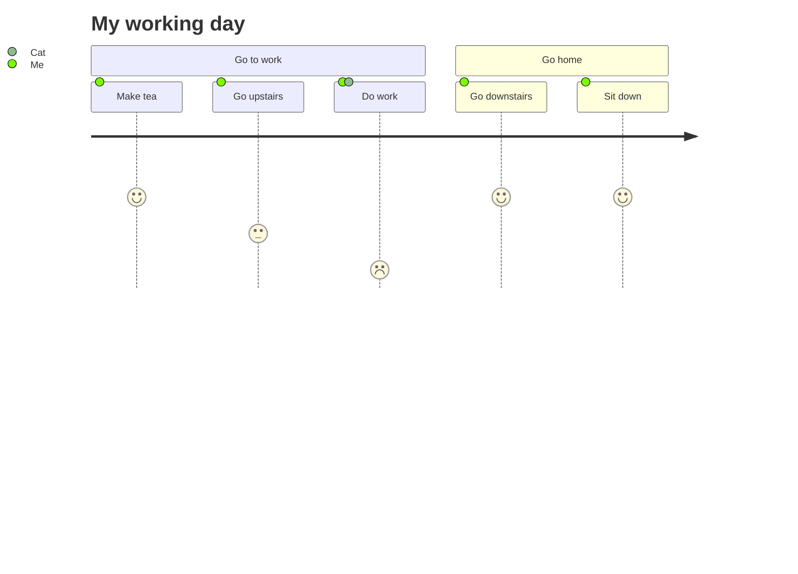

> 首先需要介绍的还是臭名昭著的 [The Great Firewall of China][1]。这个东西可能就是后面很多项目、大佬、乃至这篇文章的出现的原因了，单单是这个就能拿出无数的文章来讲述前因后果和历史，这边不会展开，感兴趣可以自行搜索展开。简单来讲就是祖国为了控制舆论和过滤外部有害信息就建造了一个国家级别的防火墙，目的就是把他们认为有害的内容完全过滤掉，不让国民能够看到。而这个实施过程中，存在大量非客观标准、历史原因、技术局限等因素导致的一定程度上的误伤，因此部分学术科研、外贸、技术从业人员（包括但不限于）出于自身的需要，展开了一场旷日持久的对抗行动，其中出现了数不胜数的工具、方案等等，如果出有兴趣可以自行搜索，可惜互联网没有记忆，可能很多东西已经无迹可寻了。也不得不被动感谢祖国，因为有了GFW的存在，让更多的人学会了翻墙和使用VPN，也学会了各种网络知识。但反过来讲，如果你已经在网络上冲浪很久却从来没有意识到有防火墙的存在的话，那么你可能需要花更多的时间进行资料的搜集、文档的阅读、工具的学习等等。本文章假定读者具备一定的文档阅读、资料的搜寻、代码阅读等问题排查和解决的能力。



那么问题就很简单了，既然我们在这样一个国家，且无法和国家机器对抗，且网络环境如此恶劣，我们如何才能保证自己的网络访问质量呢？真想只有一个，那就是VPN。有人评价过Shadowsocks并不是技术有多高深，它最成功的地方在于它的出现带动了一系列的全生态的工具的出现，实现了各种场景下的翻墙需求。也因此，这么一个“古老”的协议（事实上是clowwindy开发出来后使用了一段时间没问题了之后才开源的，也在15年的时候被迫停止了更新，因为被国安请求喝茶了。恶劣的政治伤害、开源社区的畸形和缺少反馈让他非常痛苦以及失望，因此这个大佬目前已经肉身出墙了），能够拥有如此强盛的生命力，到现在都还是主流的翻墙方案（也有一些其他的类似于wireguard、各种杀毒的VPN、openVPN、IPSec、V2ray等等的方案），也是非常令人佩服的。

与本文章相关的主要需要介绍的是：
- [Dreamacro][2] 开发的 [Clash][3]
- [clowwindy][4] 开发的 [Shadowsocks][5]
- [vernesong][6] 开发的 [OpenClash][7]
- [tindy2013][8] 开发的 [subconverter][9]
- [crossutility][10] 开发的 [Quantumult-X][11]
- [OpenWRT][12]

...占坑，有机会会补充家庭网络拓扑图。


```
acme.sh --issue  --domain home.d0zingcat.xyz --dns dns_cf --server letsencrypt
```

链路是这样的：外部请求->查询profile->组装私有url，渲染模版<-请求外部配置文件<-请求外部规则｜请求外部模版
等于说出了profile是需要私有维护的（因为有机场、节点信息），其他规则类东西（比如rule、fake-ip-filter等等）我全部都丢在了gist上面，需要的人就可以拿去用作为他们自己的规则

除了profile是需要私有维护的（因为有机场、节点信息），其他规则类东西（比如rule、fake-ip-filter等等）我全部都丢在了gist上面，需要的人就可以拿去用作为他们自己的规则

现在我发现有啥不对的地方只要自己加规则就行，比如如果有网站不能访问（而默认策略是直连）的话，那么就添加这个规则：https://gist.github.com/d0zingcat/a7e47d68d2eccf0359f4ad23be2547f8 
如果我发现有什么网站默认走了翻墙但是需要直连（默认策略是翻墙）的话，那么我就添加这个规则：https://gist.github.com/d0zingcat/20be92d69ae060281ff2eaae6fcfec41
如果我发现什么app/网站监测了MITM和dns 或者做了什么特别的操作不是常规http请求的话，那么就添加这个fake-ip-filter：https://gist.github.com/d0zingcat/f2eab7420ce41f1b031e65e04fd71dbf

我：全局了！我女票：网怎么这么慢！淘宝怎么访问不了了！爱奇艺怎么看不了了！
我：全局了！招商银行：检测网络异常，禁止访问！
我：全局了！机场/节点供应商：流量用完了！BT：我干的！


还不能忘了 openclash 可能有规则，需要` mv openclash_custom_fake_filter.list openclash_custom_fake_filter.list.back` 才可以不覆盖 fake-ip-filter。（具体可以参考openclash的代码，都是shell和lua很好读）

[1]: https://en.wikipedia.org/wiki/Great_Firewall
[2]: https://github.com/Dreamacro
[3]: https://github.com/Dreamacro/clash
[4]: https://github.com/clowwindy
[5]: https://github.com/clowwindy/shadowsocks-libev
[6]: https://github.com/vernesong
[7]: https://github.com/vernesong/OpenClash
[8]: https://github.com/tindy2013
[9]: https://github.com/tindy2013/subconverter
[10]: https://github.com/crossutility
[11]: https://github.com/crossutility/Quantumult-X
[12]: https://openwrt.org/
