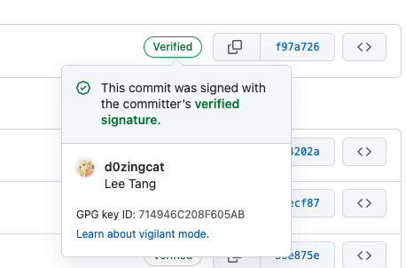

## 添加签名
如果实现了GPG Sign签名，那么你在Github上面的提交应该是像这个样子的：


首先你应该把Github官方的文档（左边栏关于添加GPG签名的所有文档）都通读或者操作一遍：[Commit signature verification][1] 。因为所有你可能会遇到的情况 github 都已经很贴心地写了文档，而且这些文档都非常地简单易懂。
然后你就可以仿照下面提到命令进行操作：

```bash
gpg --full-generate-key
# use ecc
gpg --list-secret-keys --keyid-format=short
# choose the id which line begins with ssb behind cv25519
gpg --armor --export KEYID | pbcopy 
# add to github ssh and gpg keys
# config git to use gpg key to sign commits
git config --global commit.gpgsign true
git config --global user.signingkey KEYID
# add to ~/.zshrc
export GPG_TTY=$(tty)
# install plenary-mac
brew install pinentry-mac
```

## 备份及还原

可以顺带一提的是 GPG 的备份，可以简单通过：`gpg --export-secret-keys --armor --output privkey.asc user-id` 进行备份，`--armor`的意思是转换二进制为可读的文字，这样可以方便打印出来，也可以转换成二维码之后再打印出来，因为最好的备份方式还是物理备份（如果这张纸不幸被偷那么另说）。我的话是直接丢在云盘上面的，这个可能是我盲目自信了。

我还没有还原过，不过根据资料是这样的：`gpg --import privkey.asc`
应该还需要一些信任的操作，可以具体查询下面提供的参考资料。

# 参考

[Sign git commits on GitHub with GPG in macOS][5]

[Methods of Signing with GPG on MacOS][2]

[GnuPG (简体中文)][3]

[Anatomy of a GPG Key][4]

[backup-and-restore-a-gpg-key][6]

[How to backup gpg keys on paper][7]
[Setting up a GPG verification on the GitHub][8]

[GPG: Change email for key in PGP key servers][9]

[1]: https://docs.github.com/en/authentication/managing-commit-signature-verification/about-commit-signature-verification
[2]: https://gist.github.com/troyfontaine/18c9146295168ee9ca2b30c00bd1b41e
[3]: https://wiki.archlinux.org/title/GnuPG_(%E7%AE%80%E4%BD%93%E4%B8%AD%E6%96%87)#%E5%A4%87%E4%BB%BD%E4%BD%A0%E7%9A%84%E7%A7%81%E9%92%A5
[4]: https://davesteele.github.io/gpg/2014/09/20/anatomy-of-a-gpg-key/
[5]: https://samuelsson.dev/sign-git-commits-on-github-with-gpg-in-macos/
[6]: https://www.jwillikers.com/backup-and-restore-a-gpg-key
[7]: https://linuxconfig.org/how-to-backup-gpg-keys-on-paper
[8]: https://codex.so/gpg-verification-github
[9]: https://coderwall.com/p/tx_1-g/gpg-change-email-for-key-in-pgp-key-servers
