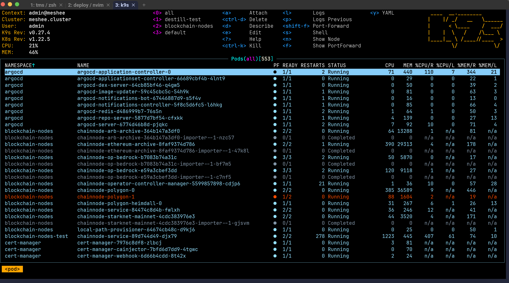
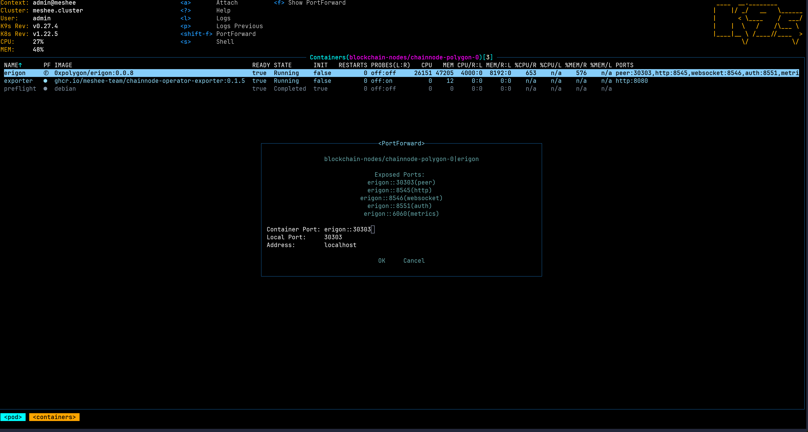
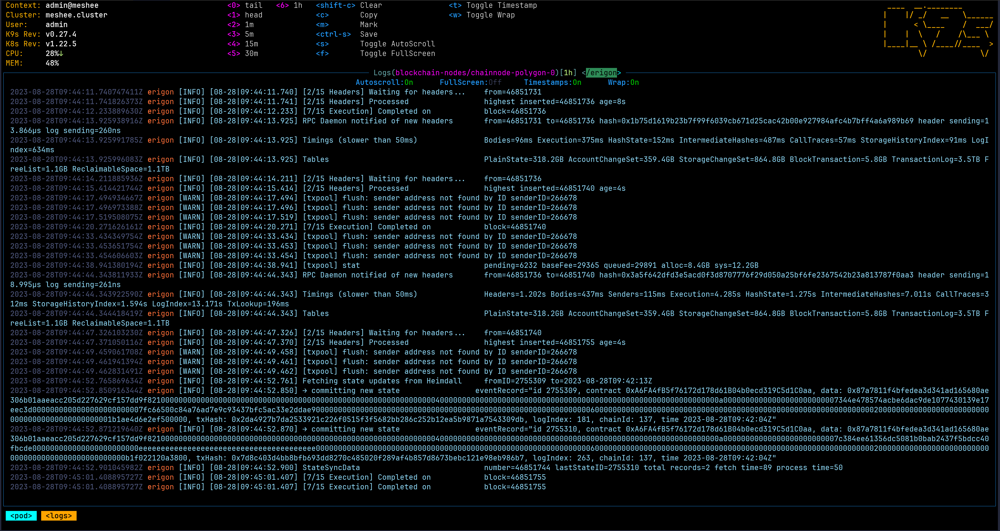

# K9S 快速上手指南

👉[官网地址](https://k9scli.io/) 

> 如果是 Mac 用户的请首先安装 [homebrew](https://brew.sh/) 。如果有余力的话可以阅读官方的文档，也可以直接 Google 别人写的一些教程，对于了解这个工具会有很大的帮助；如果只是轻度使用的话，那么可以直接阅读下面的教程，我会介绍一些我日常中使用的 cases。
> 

# 一句话描述

一个终端下的 kubectl 的可视化界面，可以快速上手和快捷地查看日志、pod等操作而无需记忆复杂的命令。

# 对比 kubectl

- Pros
    - 可视化
    - 满足大部分 k8s 运维场景/功能的同时操作非常简便
- Cons
    - 需要学习基本操作，且此操作不能复用在其他场合/工具
    - 第一次连接初始化比较慢（公司集群在海外决定，暂无很好的优化办法）
        - 但连接之后是长链接，在链接被关闭之前界面会一直保持，操作相对比较顺畅

# 安装及配置

1. 安装

`brew install k9s`

1. 申请相关的 k8s 权限
2. 配置 k8s config 文件
    1. 一般可以得到一个 config 文件
    2. 把上一步的文件存储在 `$HOME/.kube/config` 路径
    3. [拓展阅读](https://kubernetes.io/docs/concepts/configuration/organize-cluster-access-kubeconfig/)
3. 新开一个窗口进行操作,输入`k9s` 回车启动
    1. `k9s -n {namespace}` 直接访问具体某个 namespace 
        1. 也可以进入了程序之后切换 namespace
    2. `k9s -c {pod_name}` 直接访问具体某个 pod

# 常用操作

## 通用操作

- 观察页面置顶的展示，已经提示了一些高频操作的快捷键
- `/` 是搜索，输入后回车，也叫做 filter 模式
- `Esc` 是退出
- `?` 是查看帮助，包括全量的快捷键
- `:` 是全局命令，例如 `:ns` 即可进入切换 namespace 的界面
    - 可以用 tab 补全

## 默认页面

- 最常用的操作在**页面上方已经置顶**，建议好好阅读一下
    - 也有一些关键信息
        - k8s 集群的版本
        - CPU/MEM 的使用情况
- 使用上下方向键切换具体的pod
    - 也可以 jk vim-like 键位操作
        - `j` = ⬆️
        - `k` = ⬇️
        - `gg` = 最上面
        - `shift + g` = 最下面
    - 也可以鼠标滚轮上下滑动操作
- 蓝色的表示正常，红色的表示 pod 没有就绪
    - 指标一一做了展示，可以看到
        - 当前的状态
        - CPU的实际使用
        - Request占比（%CPU/R)
        - Limit占比（%CPU/L）
        - memory 同理
        - Pod IP
        - 运行在哪个 Node
        - Age
    - 不定期刷新页面会有上下箭头指示 pod 的 cpu/mem 的变化情况
- `shift+f` 可以做端口转发
    - 填写好 container 的 port 、local port 回车选中 Ok 即可在退出 k9s 之前都生效
- `d` 可以 describe pod，对于 pod 无法启动（例如卡在 init 状态会 debug 会有很大的帮助）
    - 主要关注 `State` 下的 `Reason` 和 `Exit Code` 即可，**对于排查问题非常有帮助！**
- 移动到具体的 pod 按 `l`（小写 L）即可查看 pod 中所有 container 的日志
    - `p` 查看之前的 pod 的日志（如果 pod一直异常重启可以通过这个方式查看到前一次重启前的日志），**对于排查问题非常有帮助！**
- 选中具体某个 pod `回车`即可进入查看有哪些 container
- `s` 即可进入 pod 中第一个 container 的 命令行
- `<ctrl>+k` = `kubectl delete pod xxx` ，相当于杀死某个 pod （`kill -9` ），但 pod 被杀了之后会重启自动拉起
- `<ctrl>+r` 刷新页面
- `y` 可以查看 对应的 yaml 定义
    - 高级玩家可以尝试
- 上面提到的快捷键同样适用于 container

## 日志界面

- `/` 输入即可过滤日志关键词 回车即可显示
- `w` 启用长文本换行展示（直接页面敲击），再按关闭
- `5` 启用查看最近 30m 的日志，其他时间见置顶
    - `0` 看最尾部的日志
    - `1` 看最头部的日志
- `t` 展示时间戳，再按关闭
- `f` 全屏展示，再按退出
- `s` 关闭日志滚动（默认启用），再按启用

