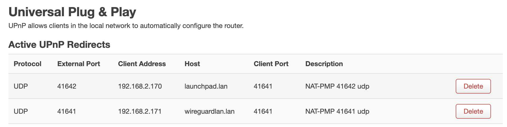
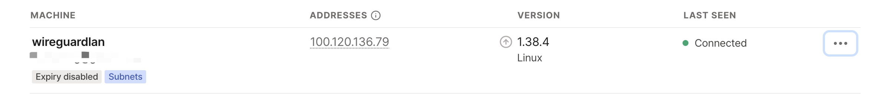
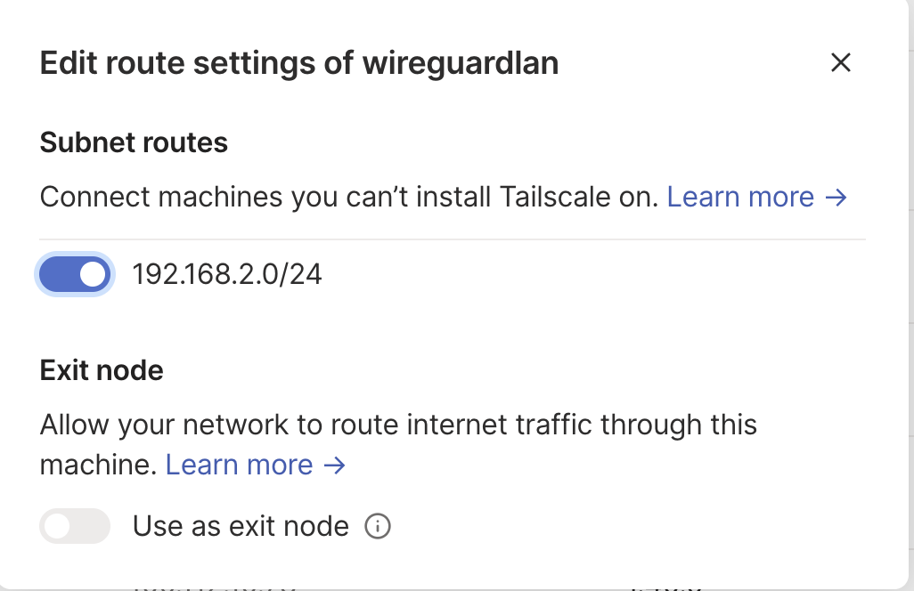
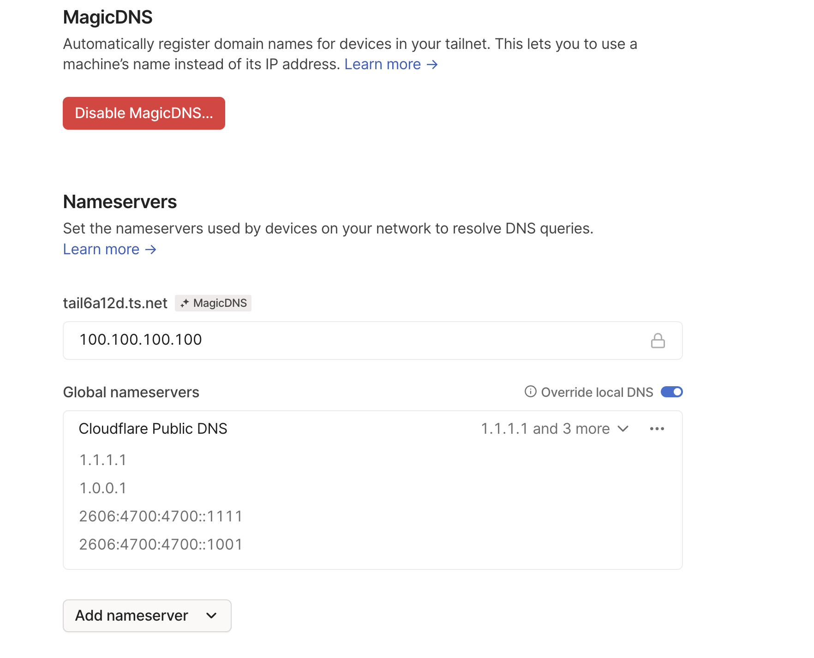

> 在这篇文章 [使用VPN组建局域网打通工作和家庭网络](https://blog.d0zingcat.dev/p/vpn-connect-work-home/)我有详细的介绍我目前的需求和原因，当前的实现方式，以及期望达到的效果，在阅读本篇文章之前可以先把这篇文章先阅读一下会更加有助于对本篇文章的理解。


# 前情

我考虑 Tailscale 的几个因素：
- 客户端开源且技术能力强（博客和文档写的非常专业）
- 点对点星型组网，自带 NAT 穿透
- 超过 zerotier 的使用体验（支持简单组网、自定义 DNS、中转节点、子网分配）
- 跨平台（甚至手机也可以用）
- 社区流行
- 基于 Wireguard 这个已经进 Linux 内核的协议

就这些优点就已经足以让我对它产生浓厚的兴趣并进行尝试了。

# 安装

[安装教程](https://tailscale.com/kb/installation/)

不具体展开，我的例子是 Mac 直接 App Store 安装（即可配备图形界面），Linux 直接使用官方的脚本进行安装。
Mac 安装之后点击 login 使用自己账号登录并查看对应的连接信息，点击 Connect 即可连接设备；
Linux 则需要使用命令 `sudo tailscale up` 进行上线，会打印出登录链接，复制到浏览器中登录账号连接即可。
Mac 需要在 Settings 勾选 Start at login 配置开机自启（建议开启），Linux 则需要使用命令 `sudo systemctl enable tailscaled`

上线完成后关键命令为：

`sudo tailscale status` 即可查看所有的私网下的设备信息

`sudo tailscale netcheck` 即可查看当前节点和网络中的中转服务器的连接情况

# 自建 Derp 节点

虽然 tailscale 自带内网穿透，但总归有一些墙是穿不透的，可以阅读这篇文章：[How NAT Traversal Works](https://tailscale.com/blog/how-nat-traversal-works/)，对于无法正常穿透的网络状况，tailscale 只能选择公网服务器转发的方式实现穿墙（例如 FRP）。但很遗憾的是由于各种原因 tailscale 并没有在中国大陆提供一台转发的服务器，因此如果存在这样网络环境的机器，即便有 tailscale 帮忙转发，速度也是巨慢无比（很大程度取决于访问最近的一台转发服务器的速度，可能是香港或者日本的机器，但过去的线路都很一般），基本是不可用的，因此我们就需要自建转发服务器，以实现最快速度的访问。

Derp 就等于 Zerotier 中的 Moon 节点，但是机制上存在一些差异，例如 Moon 是基于 Zerotier 自定义的协议，而 Derp 是基于 HTTPS 的；Moon 的机制是黑盒，而 Derp 是先通过中转连接两端后再升级到 NAT （如果可以打洞的话）；从我的角度来看 tailscale 的方案会更加稳健和可靠，也能更加应对各种恶劣的网络环境。

首先需要购买一台国内的服务器，以我为例，我购买的是 腾讯云-云产品-轻量应用服务器 shanghai-2C-2G-40G-4Mbps 一个月 300 GB 流量（真黑，早知道早期的轻量云就一直续费了，现在的机器配置一降再降），费用是一年 452 人民币。配置很低，但是跑 Docker 和 Derp 足够了（我还用来做 Syncthing 的同步节点），只要不是长时间上传大文件，我的主要场景是 macOS 的远程连接是足够了，速度也还可以。

Docker 安装配置不多说，参考官方教程：[Install Docker Engine on Debian](https://docs.docker.com/engine/install/debian/) 
同样建议使用 `sudo systemctl enable docker` 设置开机自启，以及使用 `sudo usermod -aG docker $USER` 添加当前用户到 docker 组中，这样可以不用 sudo 来调用 docker 命令。

上面有提到，Derp 基于 HTTPS，换言之我们需要有一个 SSL 证书。Derp 官方的镜像据说支持 Caddy 的拓展，理论上来讲是可以自动续获取并续签证书的，但我并没有实验成功，可能还是和服务器厂商的一些网络策略有关系（中国大陆没有备案的域名不允许解析到服务器上，且不能使用 80 443 这类标准端口，即便是 https 一样也会被检测 SNI 以实现拦截），但我显然不愿意再备案一次了。于是换个方法，直接使用腾讯云提供的一年免费 SSL 证书，在 云产品-SSL证书 下可以找到，基于 TrustAsia 一年有效期，一个账号最多申请 20 个，也足够了，到期了续期有点点麻烦罢了。作为域名的持有者我们很方便地可以通过 DNS 验证的方式验证域名，正常情况下签发证书很快，验证后 5 Min 就能完成签发，然后下载 nginx 的证书即可。

可以直接参考我的 docker-compose.yml 附赠 syncthing（额外说一句，如果你有多个设备且需要多设备之间数据同步，文件数量比较巨大，且你希望尽可能快速地点对点地双向同步，那你就应该考虑使用这个而不是 iCloud 或者其他各种 Drive）
```yaml
version: '3'
services:
  syncthing:
    container_name: syncthing
    image: syncthing/syncthing
    environment:
      PGID: 1000
      PUID: 1000
    network_mode: host
    restart: always
    volumes:
      - ./syncthing/:/var/syncthing/
  derper:
    container_name: derper
    image: fredliang/derper
    restart: always
    volumes:
      - ./derper/cert:/cert
      - /var/run/tailscale/tailscaled.sock:/var/run/tailscale/tailscaled.sock # 共享 tailscaled.sock
    ports:
      - 3478:3478/udp
      - 23479:23479
    environment:
      DERP_DOMAIN: {domain}
      DERP_ADDR: ":23479"
      DERP_CERT_MODE: manual
      DERP_CERT_DIR: /cert
      DERP_VERIFY_CLIENTS: "true"
volumes:
  logvolume01: {}
```

需要注意的是 cert 目录挂载的是前面下载的 nginx 的证书（有四个文件），需要一一重命名为 {domain}.crt {domain}.key {domain}.pem
`docker compose up -d` 启动即可。
然后需要去 tailscale 的 [Admin Console-Access Control](https://login.tailscale.com/admin/acls) 配置对应的 derp 服务器，例如：
```json
// Example/default ACLs for unrestricted connections.
{
	// Declare static groups of users beyond those in the identity service.
	"groups": {
		"group:example": ["user1@example.com", "user2@example.com"],
	},

	// Declare convenient hostname aliases to use in place of IP addresses.
	"hosts": {
		"example-host-1": "100.100.100.100",
	},

	// Access control lists.
	"acls": [
		// Match absolutely everything.
		// Comment this section out if you want to define specific restrictions.
		{"action": "accept", "src": ["*"], "dst": ["*:*"]},
	],
	"ssh": [
		// Allow all users to SSH into their own devices in check mode.
		// Comment this section out if you want to define specific restrictions.
		{
			"action": "check",
			"src":    ["autogroup:members"],
			"dst":    ["autogroup:self"],
			"users":  ["autogroup:nonroot", "root"],
		},
	],
	"derpMap": {
		"Regions": {
			"900": {
				"RegionID":   900,
				"RegionCode": "myderp",
				"Nodes": [
					{
						"Name":     "1",
						"RegionID": 900,
						"HostName": "{domain}",
						"DERPPort": 23479,
					},
				],
			},
		},
	},
}

```

保存之后挑选一台节点使用 `sudo tailscale netcheck` 即可发现已经自动连接了 derp 节点，而且速度非常感人

```
Report:
        * UDP: true
        * IPv4: yes, 116.233.104.155:47603
        * IPv6: no, but OS has support
        * MappingVariesByDestIP: false
        * HairPinning: false
        * PortMapping: UPnP, PCP
        * CaptivePortal: false
        * Nearest DERP: 
        * DERP latency:
                - myderp: 22.3ms  () <<<<<<<<******* this one
                - tok: 68.9ms  (Tokyo)
                - sfo: 135.6ms (San Francisco)
                - lax: 140.1ms (Los Angeles)
                - sea: 160.2ms (Seattle)
                - den: 176.8ms (Denver)
                - hnl: 185ms   (Honolulu)
                - ord: 195.1ms (Chicago)
                - dfw: 195.1ms (Dallas)
                - sin: 195.3ms (Singapore)
                - mia: 203.5ms (Miami)
                - tor: 204.2ms (Toronto)
                - hkg: 220.4ms (Hong Kong)
                - lhr: 222.1ms (London)
                - blr: 230.8ms (Bangalore)
                - nyc: 237ms   (New York City)
                - waw: 247.4ms (Warsaw)
                - par: 249.8ms (Paris)
                - ams: 252.2ms (Amsterdam)
                - fra: 275.4ms (Frankfurt)
                - syd: 281.1ms (Sydney)
                - mad: 286.1ms (Madrid)
                - sao: 324.9ms (São Paulo)
                - dbi: 330.7ms (Dubai)
                - jnb:         (Johannesburg)
```
到此 derp 节点就搭建好了。另外可以注意的是如果有子网的访问需求，例如我的例子：

家庭 LAN：192.168.2.1/24

公司 LAN：192.168.1.1/24

当公司需要访问家中的 mac 设备的时候，限于 macOS 系统的机制会自动休眠，除非禁用休眠（太伤了，不利于电池也不利于续航，损耗太大），否则只剩下一条路，万幸 macOS 支持网络唤醒，换言之休眠不是问题，关键只要有一台局域网内的设备通过局域网地址来访问 mac 即可将其唤醒。好在我还有个 Homelab 安装了 Debian，专门用于内部网络的跳板。可以参考[如何配置一台新的翻墙服务器](https://blog.d0zingcat.dev/p/how-to-setup-a-new-vpn/) 中配置 bbr 的部分，那边一起打开了系统的网络流量转发能力，这样那台机器就可以作为子网的一个跳板机了，只要在启动 tailscale 的时候使用命令 `sudo tailscale up --advertise-routes=192.168.2.0/24` 即可广播 192.168.2.0/24 的访问都通过这台机器做转发。然后去到 tailscale [Admin Console](https://login.tailscale.com/admin/machines) 点击三个点-Edit route settings 打开 Subnet routes 即可使其它他节点启用这个路由规则。而在需要访问此子网段的机器上需要手动执行一次 `sudo tailscale up --accept-routes` 以注册同意使用子网段的路由规则。

> 有些人也会选择直接在路由器上面装上 wireguard/tailscale 实现对内网的访问，但网络问题太过复杂，且排查起来非常麻烦，因此我的考虑是在路由器（OpenWRT）上尽量少引入变量（尤其是会全局改变一些配置的），以实现最大的稳定性。

2023-05-14更新：在实际使用的时候我发现即便有 UPNP，但当局域网内存在两个装了 tailscale 的设备之后就会存在两个同样的端口 41641，当暴露在公网上之后因为冲突就会有一个端口为 41642（典型的碰撞），暂时观察无法确定这种是否也能够实现半程的直连，所以为了减少变量我还是选择给路由器（openWRT）安装上了 tailscale，教程如：[Tailscale](https://openwrt.org/docs/guide-user/services/vpn/tailscale/start)







换言之，这样我就可以在公司电脑上通过 192.168.2.111（假设是家中 mac 设备的ip地址）访问了。

另外也推荐打开 Tailscale 的 MagicDNS 和 Nameserver 并启用 Overwrite local DNS，前者用于通过机器名称解析出内网 IP，后者用于强制 DNS Upstream 走公用可靠的服务，这样可以有效避免一些非验证 DNS 的错误记录导致的奇奇怪怪的网络问题，但代价就是本地一些解析可能会失效（例如 路由器的一些 *.lan 域名）。



# 参考

[DNS in Tailscale](https://tailscale.com/kb/1054/dns/?tab=macos#using-dns-settings-in-the-admin-console)

[MagicDNS](https://tailscale.com/kb/1081/magicdns/)
