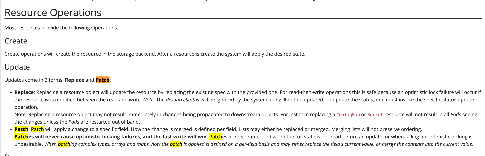

Here are some examples or illustrations that I use quite a lot in my work routine.

### How to reuse env parameter in another one(e.g. assemble many into one)

That's quite useful for database DSN configuration like work cases.

```
apiVersion: v1
kind: Pod
metadata:
  name: mysql-app
spec:
  containers:
  - name: mysql-container
    image: mysql:5.7
    env:
    - name: mysql_host
      value: "mysql.default.svc.cluster.local"
    - name: mysql_db
      value: "myapp"
    - name: mysql_port
      value: "3306"
    - name: PROTOCOL
      value: "mysql"
    - name: mysql_dsn
      value: "$(PROTOCOL)://$(mysql_host):$(mysql_port)/$(mysql_db)"
```

### Why my kustomization replaced my base `envFrom`?



You can find detail K8s Definition from [here](https://kubernetes.io/docs/reference/generated/kubernetes-api/v1.30/#envfromsource-v1-core). If there's no other notes about the `patch strategy` and `patch merge key`, that means the key is entirely replaced by the overlays one against the base, e.g. `env` from deployment will be merged along with the overlays but not the `envFrom`.
