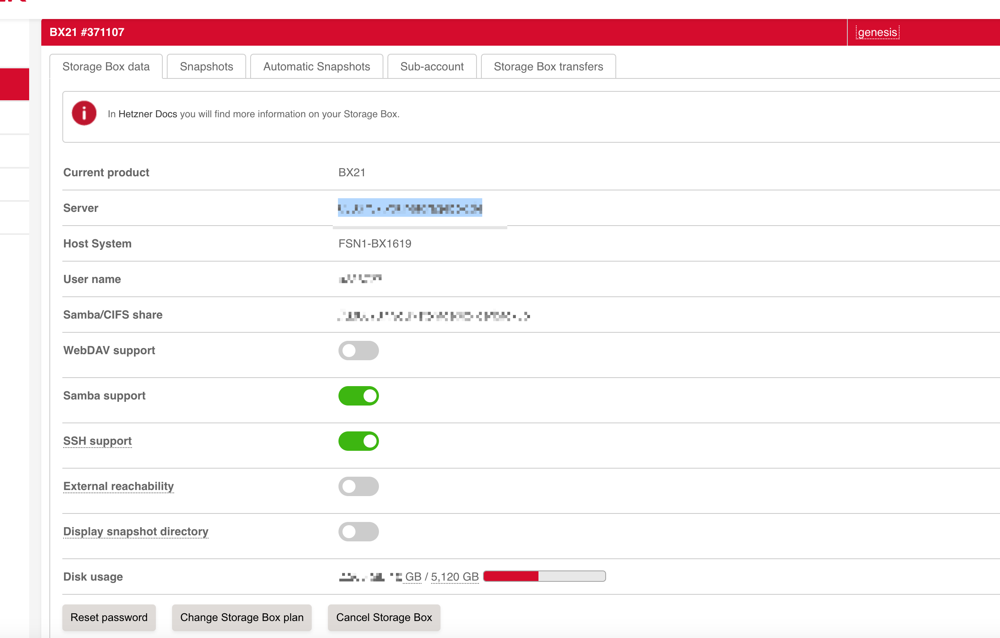
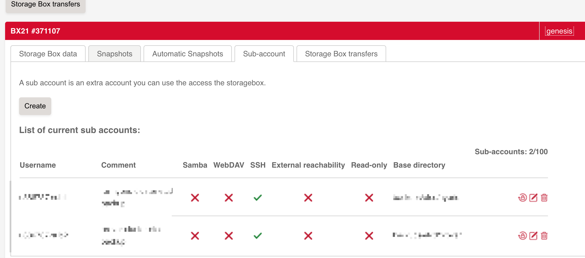

> 因为云计算的快速发展，K8s 早已经成为了现代服务的核心。而作为 K8s 的核心，etcd 集群自然有着至关重要的位置。如果使用的是云厂商托管的 K8s 那么相对简单一些，K8s 本身的升级和维护基本上云厂商都会负责，无需投入太多精力，只要定期安排好时间配合厂商做一下升级即可。但是如果是自建的 K8s 集群呢？

做好 etcd 集群的备份和恢复方案是非常关键的，在真正的故障的时候是能起到决定性的作用。

就我们的经验而言，之前发生的几次集群故障都是出自于 ETCD 集群的故障，但我们没有做好足够的备份和恢复方案，因此每当发生这样的问题的时候最后的结果总是重新安装整个集群，然后就是漫长而枯燥而痛苦的集群恢复。耗费大量的人力和物力，也会造成非常恶劣的影响，从而就流失用户了。

我们线上集群是通过 Kubespray 安装的，基于 `release-2.23`

虽然 kubespray 在每次操作的时候都会备份当前的 etcd：

https://github.com/kubernetes-sigs/kubespray/blob/master/roles/etcd/handlers/backup.yml

但我们并不能用 kubespray 的方式来备份，kubespary 的操作原则是非必要尽量不做操作。额外一提，kubepsray 也自带了 recover etcd 的方案：

https://github.com/kubernetes-sigs/kubespray/blob/master/docs/recover-control-plane.md

真的遇到 control-plane 或者 etcd 节点故障的时候可以按照说明书进行操作。

## 脚本

考虑到备份的稳定性以及目前集群中并没有做一个多备份的存储工具，暂时选择直接在其中一个 etcd 的物理机上进行脚本备份，并上传到 Hetzner 的 StorageBox 中。

```
#!/usr/bin/env bash
#
# Etcd backup
set -ex

# kubespray 安装的 etcd 集群默认会把相关的配置放在 /etc/etcd.env 文件中
ETCD_ENV_FILE=/etc/etcd.env
BACKUP_DIR=/data/scripts/etcd_backup/
# 保留 21 以内的所有备份
DAYS_RETAIN=21
DT=$(date +%Y%m%d.%H%M%S)
STORAGE_BOX_USER=xxx
# 使用相对路径，因为用户只有在自己 base 路径下的写入权限；且不能为 "." ，否则 rsync 会删除当前目录下的 ssh 密钥（因为会需要和备份目录保持完全一致）
STORAGE_BOX_SYNC_PATH=backup

# 读取 etcd 的 env 到当前 session，这样在调用 etcdctl 的时候就直接会使用 env 中定义的一些变量，例如认证证书
set -a
. $ETCD_ENV_FILE
# 还原回常规模式
set +a
 
[[ ! -d ${BACKUP_DIR} ]] && mkdir -p ${BACKUP_DIR}
find ${BACKUP_DIR} -name "*.db" -mtime +$DAYS_RETAIN -exec rm {} \;
 
ETCDCTL_API=3 /usr/local/bin/etcdctl snapshot save "${BACKUP_DIR}/etcd-snapshot-${DT}.db"
 
echo "Etcd backup success, backup file: ${BACKUP_DIR}/etcd-snapshot-${DT}.db, \
  file size: $(du -sh ${BACKUP_DIR}/etcd-snapshot-${DT}.db |awk '{print $1}')"
echo

# 使用 rsync 同步到 storage box 
echo "Now rsync to storage box..."
rsync --progress --delete -e "ssh -p23" --recursive $BACKUP_DIR $STORAGE_BOX_USER@$STORAGE_BOX_USER.your-storagebox.de:$STORAGE_BOX_SYNC_PATH
echo "Rsync done."
```

### Crontab

```
# 
# For more information see the manual pages of crontab(5) and cron(8)
# 
# m h  dom mon dow   command
0 0 * * * /data/scripts/backup_etcd.sh
```

建议都通过 storage box 的功能开通子账号，并设置 base dir，这样每个账号只有自己的目录可以控制；

同时关闭外部访问，这样只有 Hetzner 的服务器可以访问 storage box；

仅开通 ssh 访问，这样服务器上不用安装另外的软件（例如 CIFS）；

以及通过 [https://docs.hetzner.com/robot/storage-box/backup-space-ssh-keys/  ](https://docs.hetzner.com/robot/storage-box/backup-space-ssh-keys/)描述的方法设置 ssh keys ，这样脚本才能无需密码上传。



至于其他的说明，可以看这个：https://docs.hetzner.com/robot/storage-box/access/access-ssh-rsync-borg/#available-commands

## 参考

https://mp.weixin.qq.com/s/JTebrhW76JtAlDnmdShkiw
