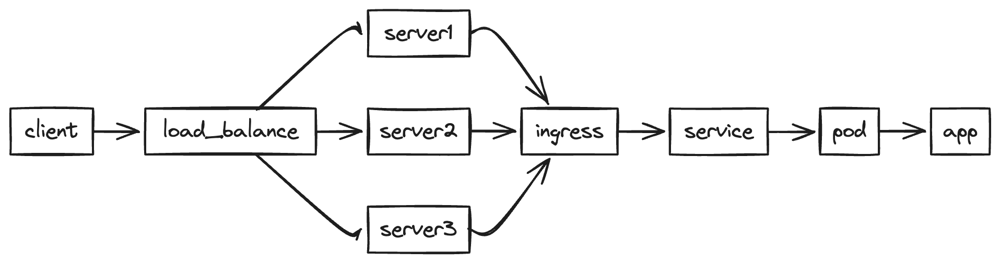
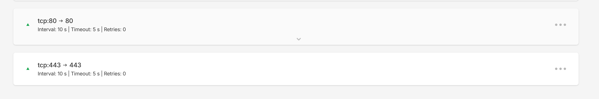
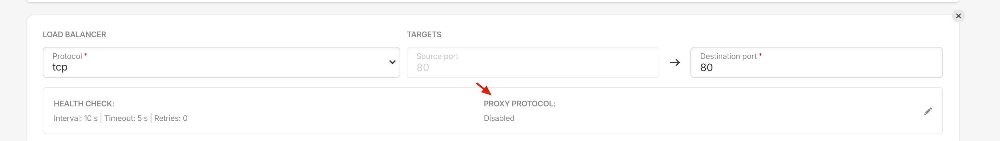
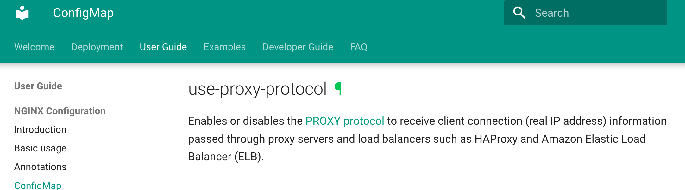

I've received complaints about inside biz pods, apps didn't get the right client (instead of public IPv4 IP, they only got in-cluster IPs like 10.233.x.y, or the host IP), so they couldn't block the over requesting clients by IP.

The topology:



As the rate limit component works fine under development, that should be due to some reasons that make the app not get correct IPs. 

Let's do quick experiments. 

```
# svc.yaml
apiVersion: v1
kind: Service
metadata:
  name: test
spec:
  selector:
    app.kubernetes.io/instance: test
  ports:
    - protocol: TCP
      port: 80
      targetPort: 8080
  type: ClusterIP
```


```
# ing.yamlapiVersion: networking.k8s.io/v1
Kind: Ingress
metadata:
  name: test
spec:
  ingressClassName: nginx
  rules:
    - host: test.abc.xyz
      http:
        paths:
          - path: /
            pathType: Prefix
            backend:
              service:
                name: test
                port:
                  number: 80
```


```
# apiVersion: apps/v1
kind: Deployment
metadata:
  name: test
spec:
  replicas: 1
  selector:
    matchLabels:
      app.kubernetes.io/instance: test
  template:
    metadata:
      labels:
        app.kubernetes.io/instance: test
    spec:
      containers:
        - name: debian
          image: python
          command: ['sleep', 'infinity']
```


Under namespace default, we use above manifests to deploy a hang pod and an ingress. Inside the pod, we could use codes below to print out the result. As it's a temporary test, we don't even need to create an SSL certificate. Instead, we only use 80 ports to receive HTTP requests.

```
#!/usr/bin/env python3
from http.server import SimpleHTTPRequestHandler, HTTPServer
import logging

class RequestHandler(SimpleHTTPRequestHandler):
    def do_GET(self):
        # Log the request headers
        logging.info("Headers:\n%s", self.headers)
        
        # Send a 200 OK response
        self.send_response(200)
        self.end_headers()
        
        # Write the headers back in the response body
        self.wfile.write(bytes(str(self.headers), "utf-8"))

    def do_POST(self):
        # Log the request headers
        logging.info("Headers:\n%s", self.headers)
        
        # Read the requested body
        content_length = int(self.headers['Content-Length'])
        post_data = self.rfile.read(content_length)
        
        # Log the requested body
        logging.info("Body:\n%s", post_data.decode('utf-8'))
        
        # Send a 200 OK response
        self.send_response(200)
        self.end_headers()
        
        # Write the headers and body back in the response body
        self.wfile.write(bytes(str(self.headers), "utf-8"))
        self.wfile.write(b"\n")
        self.wfile.write(post_data)

def run(server_class=HTTPServer, handler_class=RequestHandler, port=8000):
    logging.basicConfig(level=logging.INFO)
    server_address = ('', port)
    httpd = server_class(server_address, handler_class)
    logging.info('Starting httpd on port %d...\n', port)
    httpd.serve_forever()

if __name__ == "__main__":
    run()
```


Use the domain above to curl, and we will find the result.

```
/private/tmp/test ⎈ test (default) [15:00]
➔ curl http://test.abc.xyz/
Host: test.abc.xyz
X-Request-ID: f8608752d0a3af07acd2f702a974221c
X-Real-IP: 128.140.1.2
X-Forwarded-For: 128.140.1.2
X-Forwarded-Host: test.abc.xyz
X-Forwarded-Port: 80
X-Forwarded-Proto: http
X-Forwarded-Scheme: http
X-Scheme: http
User-Agent: curl/8.4.0
Accept: */*
```

Looks like the IP is the Load Balance IP. Not the same as the business pod but still doesn't work as we expected. 

After digging into it, we finally found that it was because of the deployment though. As we deploy ingress-nginx on bare metal, we didn't use "that" cloud native load balance. Instead, we use Hetzner Load balance to proxy TCP traffic to the server directly. Also, the way we deploy ingress(useHostNetwork) also affects the way we get real source IP. That's why we always get the Load Balance IP. 

You can read the [doc a bit more](https://github.com/kubernetes/ingress-nginx/blob/main/docs/deploy/baremetal.md), it shows how to get the Public IP under different circumstances. As for us, we use hostNetwork and there's nothing more to do with k8s itself. But we have to pass through public IP through the load balance. Turn the option on and we also have to make adjustments for the ingress config.





We have to enable proxy-protocol to adapt to the load balance option. There are a lot of options for ingress-nginx, you can read [there](https://kubernetes.github.io/ingress-nginx/user-guide/nginx-configuration/configmap/#use-proxy-protocol). 



That's it.

## A new problem: What if using Cloudflare proxy?

In most businesses  scenarios, we may want to utilize the WAF or traffic control or something, for me, I want to block abused IPs, that's why we need to use Cloudflare Proxy and set WAF rules.

The topology becomes following:


All the IP addresses we find are under the Cloudflare ASN. This is because Cloudflare proxies all the requests for us, making it evident that the client IPs are Cloudflare IPs.

To resolve this issue, we can enable the ingress-nginx snippet option by following these steps:

In the Configmap `ingress-nginx-controller` we have to add `allow-snippet-annotations: "true"`

indexThen under the specific app ingress declaration we need to add such annotation:

```
nginx.ingress.kubernetes.io/server-snippet: |
      real_ip_header CF-Connecting-IP;
```
