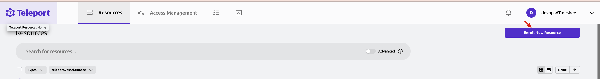
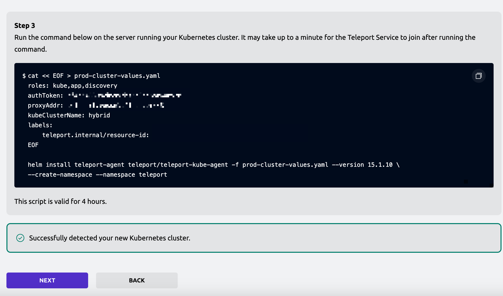
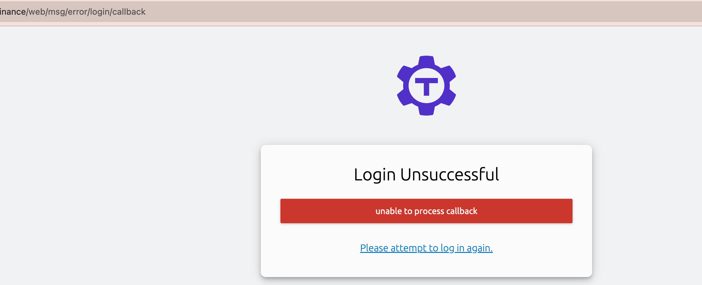
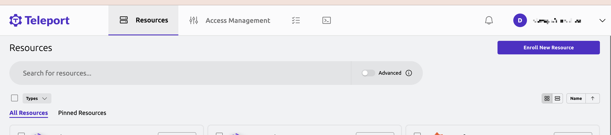
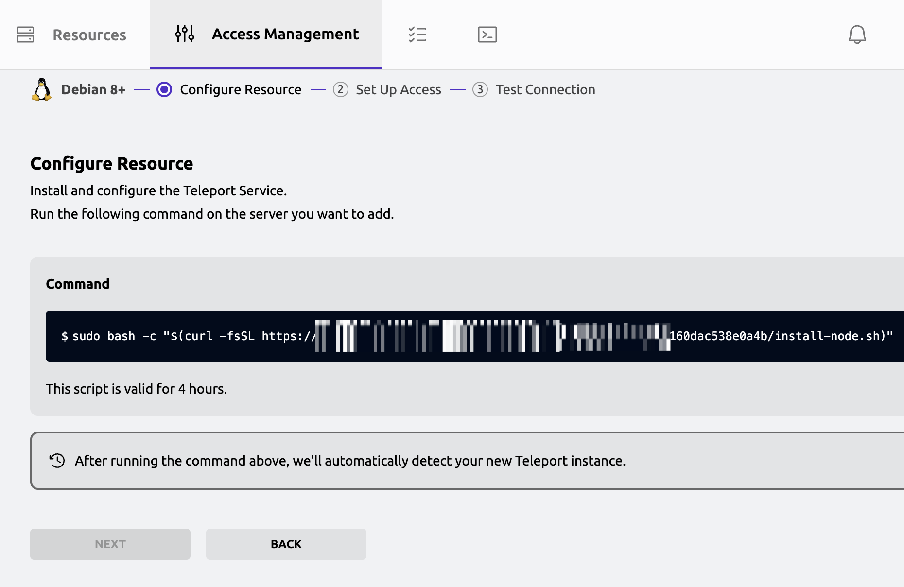

Helm Charts [here](https://charts.releases.teleport.dev/),[ ](https://charts.releases.teleport.dev/)I use terraform + [helm provider](https://registry.terraform.io/providers/hashicorp/helm/latest/docs) to install teleport charts.

We have to start from here:

https://goteleport.com/docs/reference/helm-reference/

For a K8s cluster, we need at least install no less than two components:

- [teleport-cluster](https://goteleport.com/docs/reference/helm-reference/teleport-cluster/)
  - [teleport-operator ](https://goteleport.com/docs/reference/helm-reference/teleport-operator/)is included
- [teleport-kube-agent](https://goteleport.com/docs/reference/helm-reference/teleport-kube-agent/)

A few steps further:

- [setup Github Login](https://goteleport.com/docs/access-controls/sso/github-sso/)

- [setup applications](https://goteleport.com/docs/application-access/reference/)

Also, we need [cert-manager](https://cert-manager.io/docs/installation/helm/) to issue certificates.

As we need DNS solver, this means we need to create a TXT record of that domain every time when we issue a wildcard domain to get verified by ACME, which means we need to configure according to different DNS providers. Luckily, cert-manager has handled most of DNS providers' APIs. For me, I use [Cloudflare](https://cert-manager.io/docs/configuration/acme/dns01/cloudflare/).

Behind the teleport proxy, argoCD should not run on SSL, which means we should use SSL termination and stop HTTPS redirection(If you are using argoCD charts to install):

```
configs:
  params:
    server.insecure: true
```


It's a good practice that we use a helm release to install the manifests which do not have a terraform provider or can only be applied by CRD, which means we need this chart to define our manifest:

https://artifacthub.io/packages/helm/itscontained/raw

Config ArgoCD Authentication:

https://argo-cd.readthedocs.io/en/stable/operator-manual/user-management/

If desire to use teleport SAML auth for argoCD: https://github.com/gravitational/teleport/discussions/32810

If you want to use Github to login, you have to create a oauth app first.

https://docs.github.com/en/organizations/managing-oauth-access-to-your-organizations-data/enabling-oauth-app-access-restrictions-for-your-organization

If you want to know what the CRDs are introduced by teleport:

```
➔ kubectl api-resources | grep teleport

teleportaccesslists               accesslist,accesslists             resources.teleport.dev/v1              true         TeleportAccessList
teleportgithubconnectors          githubconnector,githubconnectors   resources.teleport.dev/v3              true         TeleportGithubConnector
teleportloginrules                loginrule,loginrules               resources.teleport.dev/v1              true         TeleportLoginRule
teleportoidcconnectors            oidcconnector,oidcconnectors       resources.teleport.dev/v3              true         TeleportOIDCConnector
teleportoktaimportrules           oktaimportrule,oktaimportrules     resources.teleport.dev/v1              true         TeleportOktaImportRule
teleportprovisiontokens           provisiontoken,provisiontokens     resources.teleport.dev/v2              true         TeleportProvisionToken
teleportroles                                                        resources.teleport.dev/v6              true         TeleportRole
teleportrolesv6                   rolev6,rolesv6                     resources.teleport.dev/v1              true         TeleportRoleV6
teleportrolesv7                   rolev7,rolesv7                     resources.teleport.dev/v1              true         TeleportRoleV7
teleportsamlconnectors            samlconnector,samlconnectors       resources.teleport.dev/v2              true         TeleportSAMLConnector
teleportusers                     user,users                         resources.teleport.dev/v2              true         TeleportUser
```

If you want to get the specific resource definition:

```
➔ kubectl explain TeleportGithubConnector --recursive
GROUP:      resources.teleport.dev
KIND:       TeleportGithubConnector
VERSION:    v3

DESCRIPTION:
    GithubConnector is the Schema for the githubconnectors API
    
FIELDS:
  apiVersion    <string>
  kind  <string>
  metadata      <ObjectMeta>
    annotations <map[string]string>
    creationTimestamp   <string>
    deletionGracePeriodSeconds  <integer>
    deletionTimestamp   <string>
    finalizers  <[]string>
    generateName        <string>
    generation  <integer>
    labels      <map[string]string>
    managedFields       <[]ManagedFieldsEntry>
      apiVersion        <string>
      fieldsType        <string>
      fieldsV1  <FieldsV1>
      manager   <string>
      operation <string>
      subresource       <string>
      time      <string>
    name        <string>
    namespace   <string>
    ownerReferences     <[]OwnerReference>
      apiVersion        <string> -required-
      blockOwnerDeletion        <boolean>
      controller        <boolean>
      kind      <string> -required-
      name      <string> -required-
      uid       <string> -required-
    resourceVersion     <string>
    selfLink    <string>
    uid <string>
  spec  <Object>
    api_endpoint_url    <string>
    client_id   <string>
    client_secret       <string>
    display     <string>
    endpoint_url        <string>
    redirect_url        <string>
    teams_to_roles      <[]Object>
      organization      <string>
      roles     <[]string>
      team      <string>
  status        <Object>
    conditions  <[]Object>
      lastTransitionTime        <string> -required-
      message   <string> -required-
      observedGeneration        <integer>
      reason    <string> -required-
      status    <string> -required-
      type      <string> -required-
    teleportResourceID  <integer>
```

After installation, we have to[ configure roles](https://registry.terraform.io/providers/hetznercloud/hcloud/latest/docs) and k8s permissions. You may also want to [fine-tune k8s RBAC](https://goteleport.com/docs/kubernetes-access/controls/).


But if you want to access more than one Kubernetes clusters on just one proxy?





## Problems

### Invalid SSL certificate

If you've encountered weird problems like `teleport.abc.xyz` is Okay but `*.teleport.abc.xyz` cannot be visited like it indicates the SSL certificate is invalid or something, that means something's wrong here.

You should follow the [cert-manager troubleshooting guide](https://cert-manager.io/docs/troubleshooting/)

```
(  +---------+  )
  (  | Ingress |  ) Optional                                              ACME Only!
  (  +---------+  )
         |                                                     |
         |   +-------------+      +--------------------+       |  +-------+       +-----------+
         |-> | Certificate |----> | CertificateRequest | ----> |  | Order | ----> | Challenge |
             +-------------+      +--------------------+       |  +-------+       +-----------+
```

Follow the flow and step by step to locate the problem factor. You should also check it out for [ACME specific cases](https://cert-manager.io/docs/troubleshooting/acme/) if you are using Let's Encrypt to sign a certificate.

As the `*.teleport` domains need a wildcard domain SSL certificate and according to [cert-manager](https://cert-manager.io/v1.6-docs/configuration/acme/) we need to configure a DNS01 solver instead of HTTP01 solver(Or you can have both like me and just use the DNS01 solver to issue the `*.teleport` certificate. If not, you will get an error of [ no configured challenge solvers can be used for this challenge.](https://stackoverflow.com/questions/68219076/cert-manager-no-configured-challenge-solvers-can-be-used-for-this-challenge)

In this case, I mistakenly set `*.teleport` IP to another cluster(but I didn't know at that time), so I have had spent a lot of time debugging and troubleshooting this problem(why the teleport domain is ok but but the subdomain uses the Ingress self assigned certificate).

In addition, you should also check the if Cloudflare token is correct or the permission is settled correctly or the cluster-issuer is defined or work properly. Those will affect the issue of the certificates.

PS, the Command Name of domain `teleport.abc.xyz` may not be `*.teleport.abc.xyz`, instead, it should be `teleport.abc.xyz`.

That's different from [this answer](https://serverfault.com/questions/1101236/how-can-i-tell-if-an-installed-cert-is-wildcard-or-not).

### Teleport callback failed



### No access to k8s

```
tsh kube proxy
```


```
kubectl get po -v=10
```

It shows the error message.

```
Response Body: {"kind":"Status","apiVersion":"v1","metadata":{},"status":"Failure","message":"Your user's Teleport role does not allow Kubernetes access. Please ask cluster administrator to ensure your role has appropriate kubernetes_groups and kubernetes_users set.","reason":"NotFound","code":404}
```


### Connect servers



[](https://goteleport.com/docs/management/admin/labels/)

You will get a command and just paste the command into your server, and everything should work fine. If you need to add customized labels, you can [add Labels.](https://goteleport.com/docs/management/admin/labels/)

## References

[Using RBAC Authorization](https://kubernetes.io/docs/reference/access-authn-authz/rbac/)

[Web Application Access](https://goteleport.com/docs/application-access/guides/connecting-apps/)
