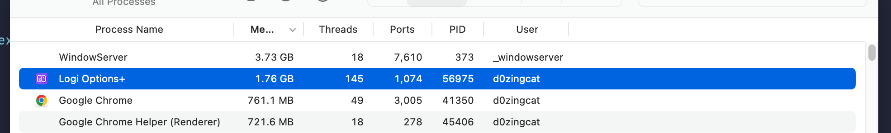
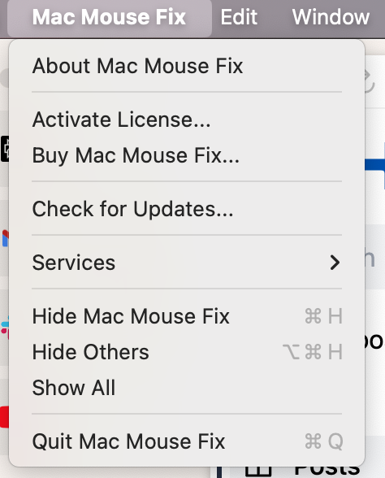
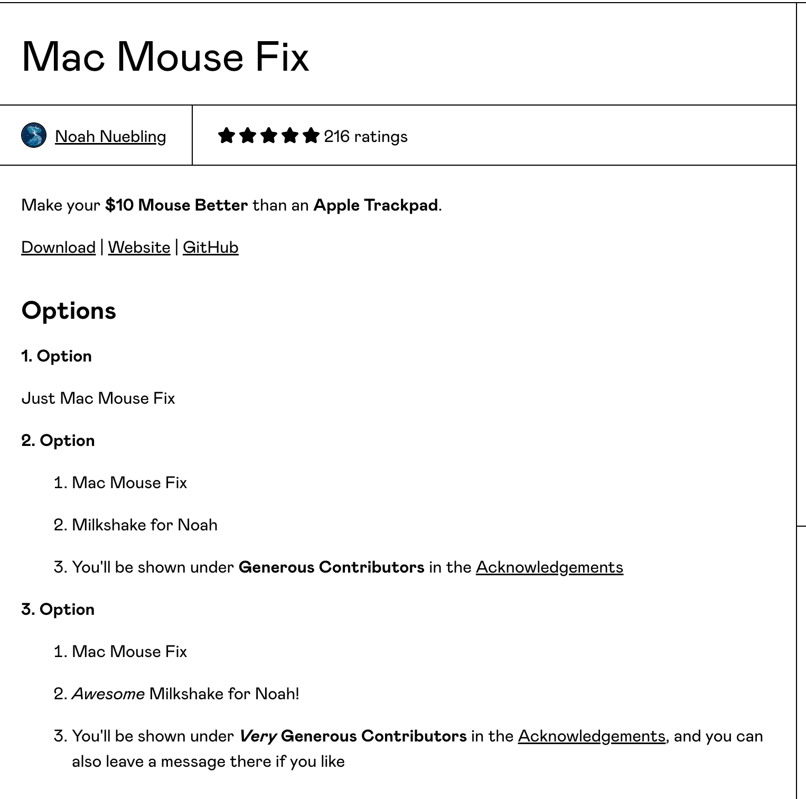
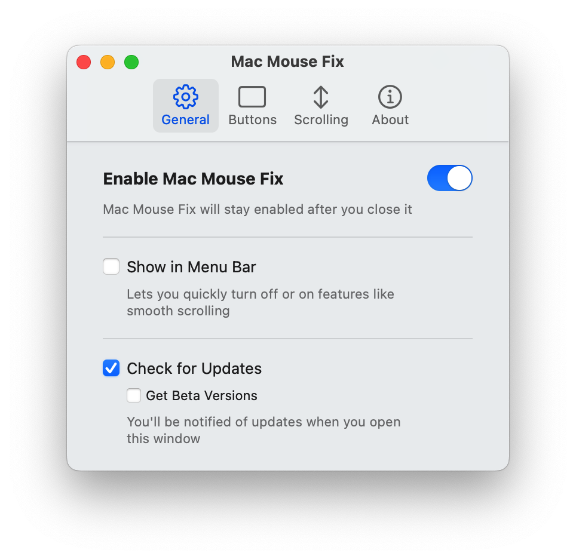
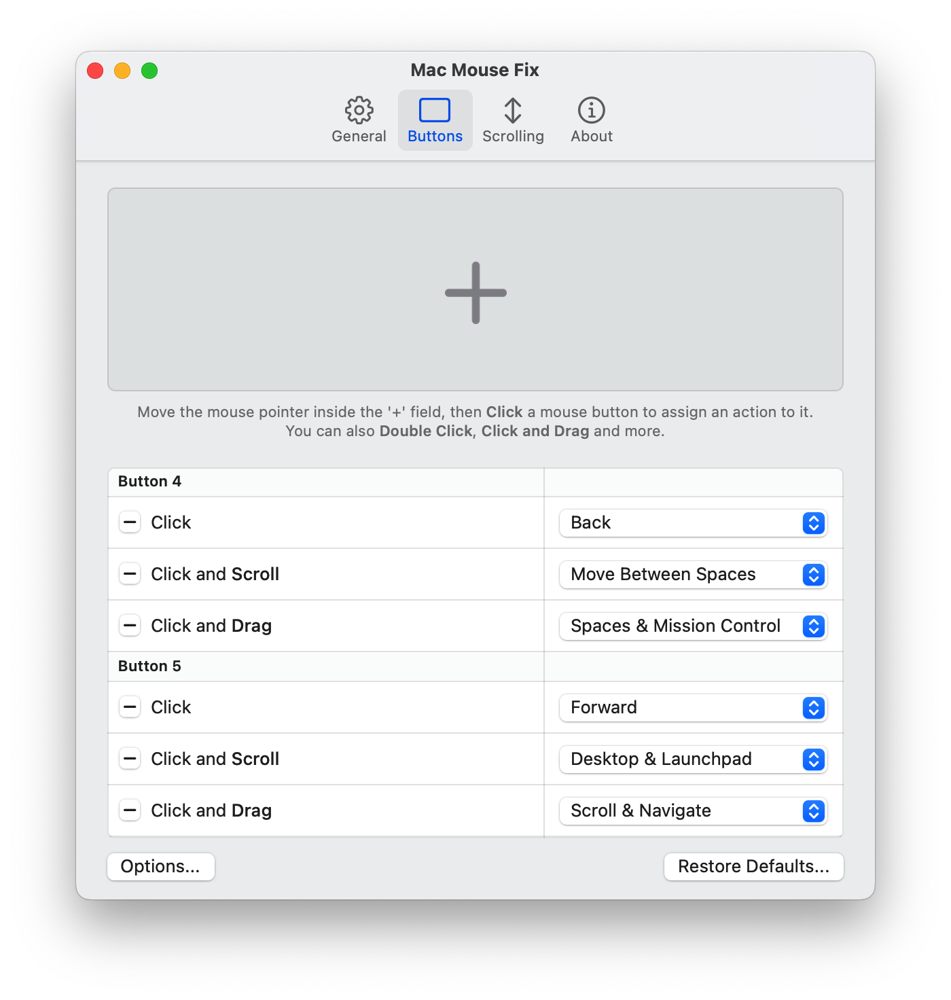
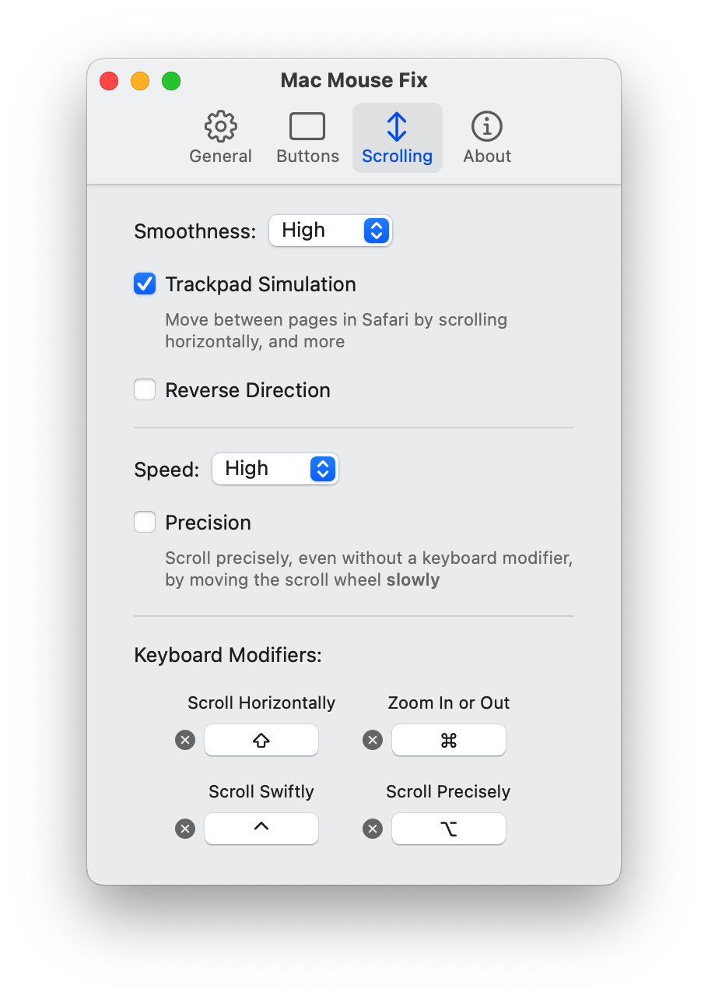

💡 Make sure your mouse uses generic USB driver other than a private or modified protocol, or the below contents may not be applied to your case. 

Further discussion: 

https://github.com/noah-nuebling/mac-mouse-fix/discussions/935

------

Today I found Logi Options Plus consumes a lot of memory:

What the heck? Should you take more than 512 MB memory, Logi? It makes no sense.

A friend recommended me an open source project: [mac-mouse-fix](https://github.com/noah-nuebling/mac-mouse-fix). I have taken a deep look into it and find that's really awesome!

You can visit the [website](https://macmousefix.com/) or just use brew to install: `brew install mac-mouse-fix`

You have 30 days to examine and it only counts when you actually use the app. So you can contemplate and do not decide whether to buy at once. If you decide to buy, it only costs for 2.99 USD, hoping the author could buy himself a coffee.

Easy to use, simply enable this software.

The default settings are good to use but I've made a few changes. 

As I am a coder and almost my works do not need to zoom in/out, instead I browser a lot so a Backward/Forward is a must to me. Also I have to switch between virtual desktops a lot, I changed one button to "Move Between Spaces". You can do it as you wish.

The default speed is a little bit slow, so I change it to High. I prefer a natural scrolling, so I unchecked the "Reverse Direction". BTW, the modifiers are really covenient, especially for the horizontally scroll and swiftly scroll.

And finally, [uninstall](https://support.logi.com/hc/en-us/articles/9926497851159-Uninstalling-Logi-Options) the Logi Options Plus.
