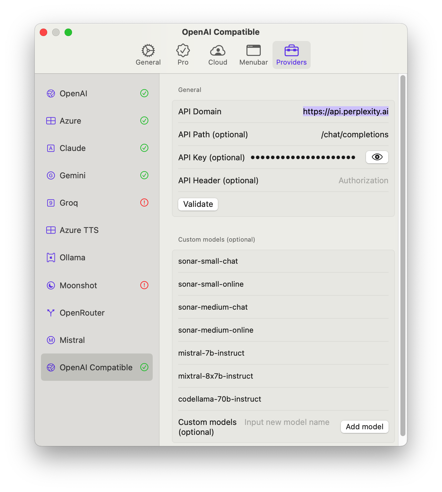

In my routine, I always use [Perplexity](https://www.perplexity.ai/) to solve my problems and help find the answers or summarize the web page or "Google that for me". What's more, if you subscribe its Pro Plan, you will get 5 USD each month for the API usage. If you are interested, you can use [my refer](https://perplexity.ai/pro?referral_code=5YCCVMM8) to register.

Brilliant. 

API usage is quite convenient and can cover the scenes in which you do not want to break the continuity of your work and want to do quick asks and get quick answers, e.g. when coding. Also, you can use LLM to do quick translations.

I used to use [Perplexity API](https://www.raycast.com/ilian/perplexity-api) inside Raycast but it's way too lightweight, e.g. it even cannot persist my conversations and I have to  provider my prompt every time. A bit annoying. 

However, I found that [OpenCat ](https://opencat.app/en/)Supports more providers like Groq, Moonshot and "OpenAI Compatible". What's meaning by that? 

We all people cannot ignore the significance of OpenAI ChatGPT's birth and it's always leading the business scope fellow(Aka Google). Every time they released a new Product/Model/API, it soon becomes the trend or standard. Therefore, a tons of LLM products design their API according to the format/formula of OpenAI's. That's why we can easily change the host and path of one provider to another without modifying our codes to make it compatible. 

There were no exceptions with Perplexity API either. So, let's do a quick experiment. 



Voila! OpenCat will automatically add API Key to request header, e.g. `Authorization: Bearer {API_KEY}` . You can find the supported models [here](https://docs.perplexity.ai/reference/post_chat_completions). 

What's more, if you are blocked by the API, you can use [this repo](https://github.com/barretlee/cloudflare-proxy/tree/main) to proxy the API. Or if you do not want to do it yourself, you can use mine: https://perplexity-proxy.d0zingcat.workers.dev .

I've made a few changes which allow you to send your api_key through URL query param and it will insert the key into Authorization Header. 

A simple case:

```
➔ curl --request POST \
     --url 'https://perplexity-proxy.d0zingcat.workers.dev/chat/completions?api_key=pplx-123456' \
     --header 'accept: application/json' \
     --header 'content-type: application/json' \
     --data '
{
  "model": "mistral-7b-instruct",
  "messages": [
    {
      "role": "system",
      "content": "Be precise and concise."
    },
    {
      "role": "user",
      "content": "How many stars are there in our galaxy?"
    }
  ]
}
```
