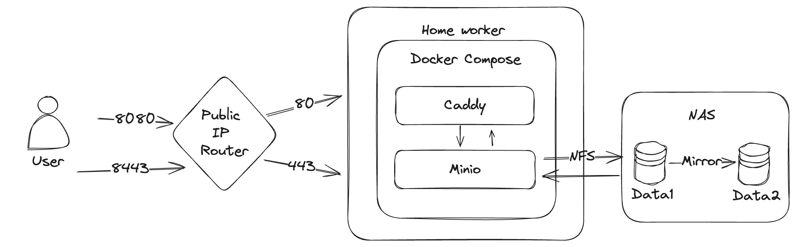
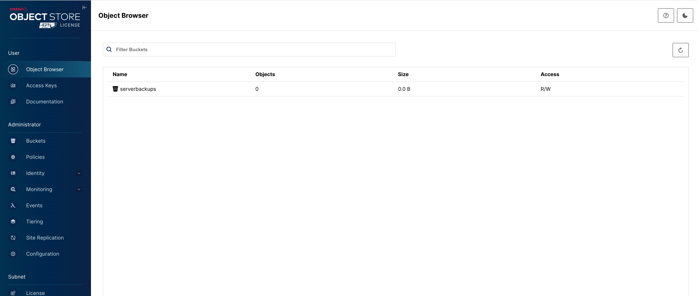

> 当私有维护的服务器变多之后，以及考虑到服务器厂商的不稳定性（例如跑路），保障服务器上起码有一个备份策略是非常有必要的。

## 存储服务搭建

之前我的做法是通过 tailscale 把服务器上的关键文件夹打包 scp 回家庭服务器上，但是这种得控制权限（设置 ssh 相关的一些参数，后面如果有机会的话可以再分享)),以及每个服务器都得配置，也是挺麻烦的。而且我也担心这样一个服务器暴露在公网上面万一被人爆破了就什么数据都丢了（例如我其中某一台服务器被黑了那么我家庭环境下所有东西都没了）。因此借这次机会尝试一下别的方案，拍脑袋想了一个：




*路由是通过端口转发来实现外网到内网端口的映射的。*

Minio 是一个自建的 S3 服务，兼容 AWS S3 协议，所以市场上大部分语言的大部分 SDK 都可以直接请求，那么备份工具只要是支持 S3 的也就可以直接配置使用了。因为我有自己的 NAS 和 公网 IP，因此我的服务放在了家里，且因为我的 NAS 本身为了数据的冗余就做了两块盘的镜像，因此我只需要单实例的 Minio 容器即可，不用考虑冗余。

参考 https://min.io/docs/minio/container/index.html 部署即可

Docker compose 如下

```
version: "3.8"
services:
  minio:
    image: quay.io/minio/minio
    container_name: minio
    networks:
      - my_network
    volumes:
      - /mnt/data/Minio:/data
    restart: unless-stopped
    command:
      - server
      - /data
      - --console-address
      - ":9001"
    env_file:
      - ./data/envs/minio.env

  caddy:
    image: iarekylew00t/caddy-cloudflare
    restart: unless-stopped
    container_name: caddy
    extra_hosts:
      - "host.docker.internal:172.17.0.1"
    networks:
      - my_network
    environment:
      - CF_API_TOKEN=${CF_TOKEN}
    volumes:
      - ./data/caddy/Caddyfile:/etc/caddy/Caddyfile
      - ./data/caddy/config:/config
      - ./data/caddy/data:/data
    ports:
      - '8080:80'
      - '8443:443'

networks:
  my_network:
```

`/mnt/data/Minio` 就对应了我的 NAS 上的存储空间，通过 NFS 挂载。

`./data/envs/minio.env` 对应的内容为：

```
MINIO_ROOT_USER=me
MINIO_ROOT_PASSWORD=P@ssword123!

MINIO_SERVER_URL=https://minio.abc.xyz:8443
MINIO_BROWSER_REDIRECT_URL=https://minio-console.abc.xyz:8443
```

需要注意的是 `MINIO_SERVER_URL` 和 `MINIO_BROWSER_REDIRECT_URL` 需要按需配置成你自己的，一个域名对应了 API URL，一个对应了后台管理；否则会发现访问域名的时候会自动跳转到 9001 的端口，那肯定不通了。

如果你前面是 nginx 的话可以参考：https://min.io/docs/minio/linux/integrations/setup-nginx-proxy-with-minio.html

如果像我一样使用的 caddy ，那么可以继续往下看。

我使用的是 `iarekylew00t/caddy-cloudflare` 这个镜像，不用自己安装直接就配备了 Cloudflare DNS 的 API 操作功能，可以直接通过 DNS verfication 来签发 HTTPS 证书，对于内网没有 80/443 端口的场景下是为数不多的选择。

申请好一个可以读写自己域的 `API_TOKEN` 然后按照我的方式配置，Caddyfile 如下：

```
{
  email me@d0zingcat.dev
  #debug
  acme_dns cloudflare {env.CF_API_TOKEN}
}

minio-console.abc.xyz {
    reverse_proxy minio:9001
}

minio.abc.xyz {
    reverse_proxy minio:9000
}
```

然后访问 https://minio-console.abc.xyz 即可看到界面



可以看到我已经创建好了 bucket，查看 minio 的日志可以看到：

```
$ docker logs -f minio
MinIO Object Storage Server
Copyright: 2015-2024 MinIO, Inc.
License: GNU AGPLv3 <https://www.gnu.org/licenses/agpl-3.0.html>
Version: RELEASE.2024-03-15T01-07-19Z (go1.21.8 linux/amd64)

API: https://minio.abc.xyz:8443
WebUI: https://minio-console.abc.xyz:8443

Docs: https://min.io/docs/minio/linux/index.html
Status:         1 Online, 0 Offline.
STARTUP WARNINGS:
- The standard parity is set to 0. This can lead to data loss.
```

如果你没有像我一样的镜像策略，建议还是跟着官方文档部署多 instance 的 minio 以保证数据的冗余性和安全性，但那已经超出了本文要讨论的内容。可以参考：https://github.com/minio/minio/blob/master/docs/orchestration/docker-compose/docker-compose.yaml

## 备份配置

关于备份有很多选择，包括但不限于直接使用 tar 打包 rclone/scp/sftp 上传。我没有做太多调查或者研究，直接拍脑袋选了 [restic](https://github.com/restic/restic?tab=readme-ov-file)。

具体的文档见[这边](https://restic.readthedocs.io/en/latest/)。

```
# install
apt-get install restic
```

我使用的 bucket 叫做 serverbackups 需要在 minio 中创建一个 access key。我设想的是每个服务器都会单独创建一个 access key 以及设置对应的目录，保证每个 key 只有自己的目录的访问权，这样即便某一个服务器被 hack 了也能隔离权限。

安装之后通过下面两条命令即可完成备份：

```
export AWS_ACCESS_KEY_ID={申请到的 key id}
export AWS_SECRET_ACCESS_KEY={申请到的 secret}
restic -r s3:https://minio.abc.xyz/serverbackups/zgovps/la1 init
# 我希望排除 syncthing 的 data 目录
restic -r s3:https://minio.abc.xyz/serverbackups/zgovps/la1 backup ~/work -e ~/work/data/syncthing/data/

# debug 模式
DEBUG_LOG=logfile.txt restic check
# 或者使用 --verbose 命令
# 使用  -e, --exclude pattern 排除不同步的目录或者文件
```

一个最小的权限设置例子如下：

```
{
 "Version": "2012-10-17",
 "Statement": [
  {
   "Sid": "VisualEditor0",
   "Effect": "Allow",
   "Action": [
    "s3:DeleteObject",
    "s3:GetObject",
    "s3:PutObject"
   ],
   "Resource": [
    "arn:aws:s3:::serverbackups/zgovps/la1/*"
   ]
  },
  {
   "Sid": "VisualEditor1",
   "Effect": "Allow",
   "Action": [
    "s3:GetBucketLocation",
    "s3:ListBucket"
   ],
   "Resource": [
    "arn:aws:s3:::serverbackups"
   ]
  }
 ]
}
```

但是实际使用下来有几个问题（且不知道有没有很好的解决办法）

- 不支持 tar ball 
  - 我的服务器有大量的小文件 而且我并不需要按照 snapshot 进行回滚，不用工具恢复，也不用增量备份，我只希望所有的文件压缩在一个包里进行保存，最简单最直接；但 restic 并不支持这种模式
- 不支持 sudo ，遇到 root 用户所有的文件就傻眼，直接没法备份（如果你也是很多服务跑在 docker 里面你也会懂的）
- 需要设置密码 备份的时候也需要输入 这就很难做自动化了

综上，考虑 restic 并不是一个很好的做法，更换成 自维护的 bash 脚本+ rclone 备份。

安装也很简单 直接通过 apt 即可

```
apt install rclone -y 
```

然后配置 s3 作为 rclone 的一个存储端

```
d0zingcat@myworker:~$ rclone config
2024/04/15 13:57:03 NOTICE: Config file "/home/d0zingcat/.config/rclone/rclone.conf" not found - using defaults
No remotes found, make a new one?
n) New remote
s) Set configuration password
q) Quit config
n/s/q> n

Enter name for new remote.
name> minio

Option Storage.
Type of storage to configure.
Choose a number from below, or type in your own value.
 1 / 1Fichier
   \ (fichier)
 2 / Akamai NetStorage
   \ (netstorage)
 3 / Alias for an existing remote
   \ (alias)
 4 / Amazon Drive
   \ (amazon cloud drive)
 5 / Amazon S3 Compliant Storage Providers including AWS, Alibaba, Ceph, China Mobile, Cloudflare, ArvanCloud, Digital Ocean, Dreamhost, Huawei OBS, IBM COS, IDrive e2, IONOS Cloud, Lyve Cloud, Minio, Netease, RackCorp, Scaleway, SeaweedFS, StackPath, Storj, Tencent COS, Qiniu and Wasabi
   \ (s3)
 6 / Backblaze B2
   \ (b2)
 7 / Better checksums for other remotes
   \ (hasher)
 8 / Box
   \ (box)
 9 / Cache a remote
   \ (cache)
10 / Citrix Sharefile
   \ (sharefile)
11 / Combine several remotes into one
   \ (combine)
12 / Compress a remote
   \ (compress)
13 / Dropbox
   \ (dropbox)
14 / Encrypt/Decrypt a remote
   \ (crypt)
15 / Enterprise File Fabric
   \ (filefabric)
16 / FTP
   \ (ftp)
17 / Google Cloud Storage (this is not Google Drive)
   \ (google cloud storage)
18 / Google Drive
   \ (drive)
19 / Google Photos
   \ (google photos)
20 / HTTP
   \ (http)
21 / Hadoop distributed file system
   \ (hdfs)
22 / HiDrive
   \ (hidrive)
23 / In memory object storage system.
   \ (memory)
24 / Internet Archive
   \ (internetarchive)
25 / Jottacloud
   \ (jottacloud)
26 / Koofr, Digi Storage and other Koofr-compatible storage providers
   \ (koofr)
27 / Local Disk
   \ (local)
28 / Mail.ru Cloud
   \ (mailru)
29 / Microsoft Azure Blob Storage
   \ (azureblob)
30 / Microsoft OneDrive
   \ (onedrive)
31 / OpenDrive
   \ (opendrive)
32 / OpenStack Swift (Rackspace Cloud Files, Memset Memstore, OVH)
   \ (swift)
33 / Pcloud
   \ (pcloud)
34 / Put.io
   \ (putio)
35 / SMB / CIFS
   \ (smb)
36 / SSH/SFTP
   \ (sftp)
37 / Sia Decentralized Cloud
   \ (sia)
38 / Sugarsync
   \ (sugarsync)
39 / Transparently chunk/split large files
   \ (chunker)
40 / Union merges the contents of several upstream fs
   \ (union)
41 / Uptobox
   \ (uptobox)
42 / WebDAV
   \ (webdav)
43 / Yandex Disk
   \ (yandex)
44 / Zoho
   \ (zoho)
45 / premiumize.me
   \ (premiumizeme)
46 / seafile
   \ (seafile)
Storage> 5

Option provider.
Choose your S3 provider.
Choose a number from below, or type in your own value.
Press Enter to leave empty.
 1 / Amazon Web Services (AWS) S3
   \ (AWS)
 2 / Alibaba Cloud Object Storage System (OSS) formerly Aliyun
   \ (Alibaba)
 3 / Ceph Object Storage
   \ (Ceph)
 4 / China Mobile Ecloud Elastic Object Storage (EOS)
   \ (ChinaMobile)
 5 / Cloudflare R2 Storage
   \ (Cloudflare)
 6 / Arvan Cloud Object Storage (AOS)
   \ (ArvanCloud)
 7 / Digital Ocean Spaces
   \ (DigitalOcean)
 8 / Dreamhost DreamObjects
   \ (Dreamhost)
 9 / Huawei Object Storage Service
   \ (HuaweiOBS)
10 / IBM COS S3
   \ (IBMCOS)
11 / IDrive e2
   \ (IDrive)
12 / IONOS Cloud
   \ (IONOS)
13 / Seagate Lyve Cloud
   \ (LyveCloud)
14 / Minio Object Storage
   \ (Minio)
15 / Netease Object Storage (NOS)
   \ (Netease)
16 / RackCorp Object Storage
   \ (RackCorp)
17 / Scaleway Object Storage
   \ (Scaleway)
18 / SeaweedFS S3
   \ (SeaweedFS)
19 / StackPath Object Storage
   \ (StackPath)
20 / Storj (S3 Compatible Gateway)
   \ (Storj)
21 / Tencent Cloud Object Storage (COS)
   \ (TencentCOS)
22 / Wasabi Object Storage
   \ (Wasabi)
23 / Qiniu Object Storage (Kodo)
   \ (Qiniu)
24 / Any other S3 compatible provider
   \ (Other)
provider> 24

Option env_auth.
Get AWS credentials from runtime (environment variables or EC2/ECS meta data if no env vars).
Only applies if access_key_id and secret_access_key is blank.
Choose a number from below, or type in your own boolean value (true or false).
Press Enter for the default (false).
 1 / Enter AWS credentials in the next step.
   \ (false)
 2 / Get AWS credentials from the environment (env vars or IAM).
   \ (true)
env_auth> 1

Option access_key_id.
AWS Access Key ID.
Leave blank for anonymous access or runtime credentials.
Enter a value. Press Enter to leave empty.
access_key_id> 

Option secret_access_key.
AWS Secret Access Key (password).
Leave blank for anonymous access or runtime credentials.
Enter a value. Press Enter to leave empty.
secret_access_key> 

Option region.
Region to connect to.
Leave blank if you are using an S3 clone and you don't have a region.
Choose a number from below, or type in your own value.
Press Enter to leave empty.
   / Use this if unsure.
 1 | Will use v4 signatures and an empty region.
   \ ()
   / Use this only if v4 signatures don't work.
 2 | E.g. pre Jewel/v10 CEPH.
   \ (other-v2-signature)
region> 1

Option endpoint.
Endpoint for S3 API.
Required when using an S3 clone.
Enter a value. Press Enter to leave empty.
endpoint> https://minio.abc.xyz

Option location_constraint.
Location constraint - must be set to match the Region.
Leave blank if not sure. Used when creating buckets only.
Enter a value. Press Enter to leave empty.
location_constraint>

Option acl.
Canned ACL used when creating buckets and storing or copying objects.
This ACL is used for creating objects and if bucket_acl isn't set, for creating buckets too.
For more info visit https://docs.aws.amazon.com/AmazonS3/latest/dev/acl-overview.html#canned-acl
Note that this ACL is applied when server-side copying objects as S3
doesn't copy the ACL from the source but rather writes a fresh one.
Choose a number from below, or type in your own value.
Press Enter to leave empty.
   / Owner gets FULL_CONTROL.
 1 | No one else has access rights (default).
   \ (private)
   / Owner gets FULL_CONTROL.
 2 | The AllUsers group gets READ access.
   \ (public-read)
   / Owner gets FULL_CONTROL.
 3 | The AllUsers group gets READ and WRITE access.
   | Granting this on a buckes generally not recommended.
   \ (public-read-write)
   / Owner gets FULL_CONTROL.
 4 | The AuthenticatedUsers group gets READ access.
   \ (authenticated-read)
   / Object owner gets FULL_CONTROL.
 5 | Bucket owner gets READ access.
   | If you specify this canned ACL when creating a bucket, Amazon S3 ignores it.
   \ (bucket-owner-read)
   / Both the object owner and the bucket owner get FULL_CONTROL over the object.
 6 | If you specify this canned ACL when creating a bucket, Amazon S3 ignores it.
   \ (bucket-owner-full-control)
acl>

Edit advanced config?
y) Yes
n) No (default)
y/n> n

Configuration complete.
Options:
- type: s3
- provider: Other
- access_key_id: 
- secret_access_key: 
- endpoint: https://minio.abc.xyz
Keep this "minio" remote?
y) Yes this is OK (default)
e) Edit this remote
d) Delete this remote
y/e/d> y

Current remotes:

Name                 Type
====                 ====
minio                s3

e) Edit existing remote
n) New remote
d) Delete remote
r) Rename remote
c) Copy remote
s) Set configuration password
q) Quit config
e/n/d/r/c/s/q> q
# 测试一下是否存在问题
d0zingcat@myworker:~$ rclone ls minio:
```

这种简单的活交给 gpt 几秒钟就能完成一个脚本，加上自己的一些特殊需求稍微改改就拿到了：

```
#!/bin/bash
set -x
export AWS_ACCESS_KEY_ID=
export AWS_SECRET_ACCESS_KEY=

# Define the directory to backup and the directory to exclude from the backup
HOME_DIR="/home/d0zingcat"
DIR_TO_BACKUP="${HOME_DIR?}/work/"
EXCLUDE_DIR="${HOME_DIR?}/work/data/syncthing/data"
BACKUP_DIR="${HOME_DIR?}/backups"
DAYS_TO_KEEP=14
S3_BACKUP_DIR=minio:/serverbackups/zgovps/la1/backups

# Get the current year and week number
YEAR_WEEK=$(date +"%Y-%U")

# Define the backup filename using the year and week
BACKUP_FILENAME="$BACKUP_DIR/backup-${YEAR_WEEK}.tar.gz"

# Check if backup dir exists
if [ ! -d $BACKUP_DIR ]; then mkdir -p $BACKUP_DIR; fi

# Create a tarball of DIR_TO_BACKUP excluding the EXCLUDE_DIR
sudo tar -czf "${BACKUP_FILENAME}" --exclude="${EXCLUDE_DIR}" "${DIR_TO_BACKUP}"

# Find and delete backup files older than 2 weeks in the backup location
find $BACKUP_DIR -name 'backup-*.tar.gz' -type f -mtime +$DAYS_TO_KEEP -exec rm {} \;

rclone sync $BACKUP_DIR $S3_BACKUP_DIR
# End of the script
```

需要注意的是我使用了 sudo （因为我需要打包 docker data，需要 root 权限才能够打包），如果没有必要的话也可以去掉。如果没有安装过也可以使用 `apt install sudo` 来安装。

然后设置对应的 crontab 即可。

```
crontab -e
# Edit this file to introduce tasks to be run by cron.
#
# Each task to run has to be defined through a single line
# indicating with different fields when the task will be run
# and what command to run for the task
#
# To define the time you can provide concrete values for
# minute (m), hour (h), day of month (dom), month (mon),
# and day of week (dow) or use '*' in these fields (for 'any').
#
# Notice that tasks will be started based on the cron's system
# daemon's notion of time and timezones.
#
# Output of the crontab jobs (including errors) is sent through
# email to the user the crontab file belongs to (unless redirected).
#
# For example, you can run a backup of all your user accounts
# at 5 a.m every week with:
# 0 5 * * 1 tar -zcf /var/backups/home.tgz /home/
#
# For more information see the manual pages of crontab(5) and cron(8)
#
# m h  dom mon dow   command
0 0 * * * /home/d0zingcat/backup.sh
```
