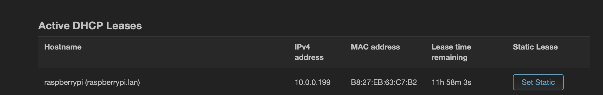

Go to here to download [Armbian OS](https://www.armbian.com/rpi4b/) or you can choose to download official [Raspberry Pi OS.](https://www.raspberrypi.com/software/operating-systems/) Both of Armbian and PiOS are based on Debian(Armbian is on Ubuntu and Ubuntu is on Debian. In other words, Armbian is also a Debian).

As I tend to use this device as my home media manager or a simple experiment workload, that's not quite necessary for me to have a Desktop Environment. Therefore, I choose to download Raspberry Pi OS Lite.


Then use [balenaEtcher](https://etcher.balena.io/) to flash into SD Card. 

After flashing, replug the SD Card (Etcher may eject the drive after flashing automatically). And go to the mounted `/boot` folder, create a file `ssh` may [enable the sshd service](https://phoenixnap.com/kb/enable-ssh-raspberry-pi) by default. 

We can also do it in terminal:

```
touch /Volumes/bootfs/ssh
```

Connect it to router by lan and power on. Go to router management web interface and find the new device IP.

But I failed to find a new device in OpenWRT, a little bit weird but it doesn't matter, as I have a monitor and mouse/keyboard on which I can manually handle it. 

After starting the device, I found it made me to choose my own username and password, and when I set up the user and it re-entered the command line user interface. 

Then get it back to the lan network and I can find the device: 


